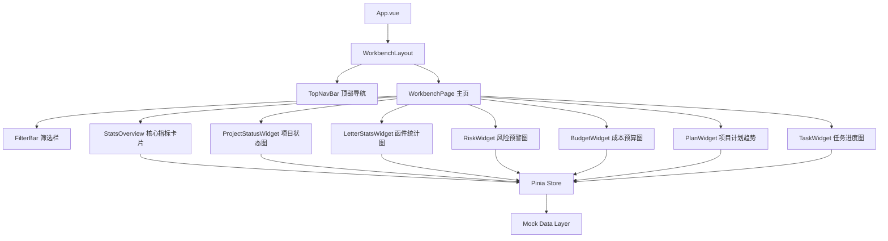

## 用户需求

设计并开发一个工业互联网平台履约项目管理应用的**工作台（Dashboard）主页**，作为应用入口页面，以可视化方式集中展示履约项目执行过程中各功能模块的统计数据与图表。

## 产品概述

页面为企业级履约项目管理平台的主工作台，面向项目经理/管理人员，提供项目执行全貌的数据驾驶舱视角。整体采用浅色商务风格，布局清晰，数据一目了然。

## 核心功能模块

- **项目数据总览**：展示项目总数、进行中/已完成/逾期项目数量，配合状态环形图
- **函件数据统计**：来往函件数量统计，按类型/状态分类，配合柱状图或趋势线
- **风险数据预警**：风险等级分布（高/中/低），未处理风险数量，配合雷达图或热力饼图
- **成本预算数据**：预算总额、已用金额、剩余金额，预算执行进度条，配合堆叠柱状图
- **项目计划完成率**：里程碑完成率、计划偏差分析，配合折线趋势图
- **项目任务进度**：任务总数、已完成/进行中/待开始任务统计，配合横向进度条或甘特风格图表
- **顶部导航栏**：平台 Logo、应用名称、用户信息、快捷操作入口
- **数据快速筛选**：支持按项目/时间范围筛选工作台数据

## 技术栈

| 层级 | 选型 |
| --- | --- |
| 框架 | Vue 3 + TypeScript（Composition API） |
| 构建工具 | Vite 5 |
| 组件库 | Ant Design Vue 4.x |
| 图表库 | Apache ECharts 5 + vue-echarts 6 |
| 样式 | CSS Variables + scoped CSS（遵循 Ant Design 设计 token） |
| 状态管理 | Pinia（轻量数据驱动，适合 Dashboard mock 数据管理） |
| 路由 | Vue Router 4（单页，预留扩展） |


## 实现方案

采用 **Vite + Vue 3 SPA** 从零搭建，工作台页面使用 **栅格化（Grid）布局 + Card 组件** 组织各模块，所有图表使用 ECharts 通过 vue-echarts 组件封装，数据采用 Mock 静态数据驱动，确保页面完整可运行。

### 核心设计决策

1. **组件化拆分**：每个功能模块封装为独立 Widget 组件，职责单一，便于复用和维护
2. **Mock 数据层分离**：所有 mock 数据集中在 `src/mock/` 下，通过 Pinia store 分发，方便后续替换真实 API
3. **ECharts 按需封装**：使用 `vue-echarts` 的 `<v-chart>` 组件统一管理图表，避免手动 init/dispose 生命周期问题
4. **响应式布局**：Ant Design Vue 的 `<a-row>` / `<a-col>` 24 列栅格，在 1280px+ 宽屏下 2-3 列排布，兼容 1440px 主流工作站分辨率

## 架构设计



## 目录结构

```
project-root/
├── index.html                          # HTML 入口
├── vite.config.ts                      # Vite 配置，配置路径别名 @
├── tsconfig.json                       # TypeScript 配置
├── package.json                        # 依赖声明：vue3/ant-design-vue/echarts/vue-echarts/pinia/vue-router
├── src/
│   ├── main.ts                         # [NEW] 应用入口，注册 Ant Design Vue、Pinia、Router
│   ├── App.vue                         # [NEW] 根组件，挂载路由视图
│   ├── router/
│   │   └── index.ts                    # [NEW] 路由配置，/ 指向 WorkbenchPage
│   ├── stores/
│   │   └── workbench.ts                # [NEW] Pinia store，管理工作台所有 mock 数据，提供 projectStats/letterStats/riskStats/budgetStats/planStats/taskStats
│   ├── mock/
│   │   └── workbenchData.ts            # [NEW] 所有模块 mock 静态数据，结构化 TypeScript 类型定义
│   ├── types/
│   │   └── workbench.ts                # [NEW] 工作台相关 TypeScript 接口定义
│   ├── components/
│   │   ├── layout/
│   │   │   ├── TopNavBar.vue           # [NEW] 顶部导航：Logo、应用名"履约项目管理"、用户头像、通知图标
│   │   │   └── WorkbenchLayout.vue     # [NEW] 整体布局框架，包含 TopNavBar + 内容区 slot
│   │   └── widgets/
│   │       ├── StatsOverviewCard.vue   # [NEW] 顶部核心指标卡片组（4个指标：项目总数/函件总数/风险数/任务完成率），横排展示
│   │       ├── ProjectStatusWidget.vue # [NEW] 项目状态分布：环形图（进行中/已完成/逾期/暂停），右侧配数字统计
│   │       ├── LetterStatsWidget.vue   # [NEW] 函件统计：近6月收发函件数量柱状图，顶部显示总收/总发数
│   │       ├── RiskWidget.vue          # [NEW] 风险预警：饼图展示高/中/低风险占比，列表展示最新5条风险项
│   │       ├── BudgetWidget.vue        # [NEW] 成本预算：横向堆叠进度条展示预算执行率，折线图展示月度支出趋势
│   │       ├── PlanWidget.vue          # [NEW] 项目计划：折线图展示计划完成率趋势 vs 基准线，显示当月完成率
│   │       └── TaskWidget.vue          # [NEW] 项目任务：横向条形图展示各状态任务数量，环形图显示整体完成率
│   ├── views/
│   │   └── WorkbenchPage.vue           # [NEW] 工作台主页面：FilterBar筛选栏 + 栅格化布局组装所有 Widget
│   └── assets/
│       └── styles/
│           └── global.css              # [NEW] 全局样式变量，覆盖 Ant Design token（主色、圆角、字体）
```

## 实现要点

1. **ECharts 按需注册**：在 `main.ts` 中仅注册用到的 ECharts 组件（BarChart、LineChart、PieChart 等），减小打包体积
2. **图表自适应**：vue-echarts 使用 `autoresize` prop，避免容器 resize 时图表不更新
3. **Mock 数据结构**：所有数字数据预设为贴近真实业务的合理值（项目 30-50 个量级），提升展示可信度
4. **Ant Design Token 定制**：通过 `ConfigProvider` 设定主色为工业蓝 `#1677ff`，营造专业商务感
5. **卡片统一样式**：所有 Widget 使用 `a-card` 包裹，统一 `border-radius: 8px`、`box-shadow` 轻阴影

## 设计风格

浅色商务风格工业互联网数据工作台。整体以白色为主背景，配合浅灰色页面底色（#F5F7FA）区分层次。顶部导航深蓝色品牌色横条，内容区 Card 白色浮层配轻阴影。配色以工业蓝为主色调，强调专业感与可信度。

## 页面结构

### 1. 顶部导航栏（TopNavBar）

固定顶部，深蓝背景（#0D2B5E），左侧工业风 Logo + "工业互联网 · 履约项目管理" 文字，右侧用户头像、消息通知图标、当前日期。高度 56px。

### 2. 筛选栏（FilterBar）

白色背景卡片，水平排列：项目选择下拉框、时间范围选择器（本月/本季/本年/自定义），右侧"刷新数据"按钮。营造控制感。

### 3. 核心指标概览（StatsOverviewCard）

4个等宽指标卡片横排：项目总数（蓝色图标）、函件总数（绿色图标）、待处理风险（橙色图标）、任务完成率（紫色图标）。每卡片含大字数字、指标名称、环比增减趋势箭头。

### 4. 图表区域第一行（2:1 布局）

- **项目状态分布**（宽16列）：圆环图展示四种状态占比，左图右表，图表内中心显示总项目数
- **风险预警**（宽8列）：饼图+右侧风险等级列表，高风险标红色，中风险橙色，低风险绿色

### 5. 图表区域第二行（1:1 布局）

- **函件统计**（宽12列）：近6个月柱状图，收函/发函双色柱
- **成本预算执行**（宽12列）：预算总额/已支出/剩余三段水平进度条 + 月度支出折线趋势

### 6. 图表区域第三行（1:1 布局）

- **项目计划完成率**（宽12列）：折线图，实际完成率曲线 vs 计划基准线，面积填充
- **项目任务统计**（宽12列）：横向条形图展示已完成/进行中/待开始任务数量分组